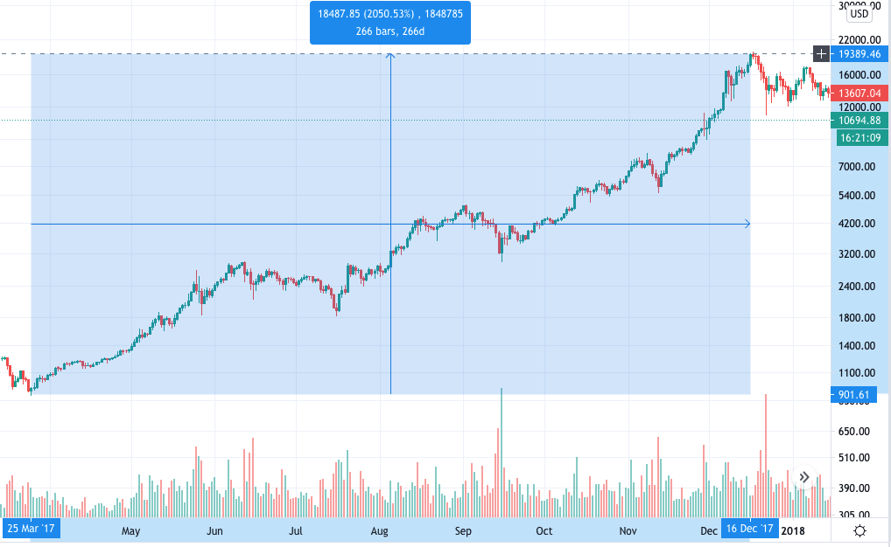

# Trader Backtest

High-performance backtesting engine written in C++ for evaluating trading strategies restricted to a single trading pair (e.g. BTC/USD) and finding their optimal hyper-parameters. Licensed under [MIT](http://opensource.org/licenses/MIT).

 * **Dependencies**: [Protocol Buffers](https://github.com/protocolbuffers/protobuf), [GFlags](https://github.com/gflags/gflags), [Google Test](https://github.com/google/googletest), [Bazel](https://bazel.build/).
 * **Data Analysis Tools**: [Python3](https://www.python.org/), [Jupyter](https://jupyter.org/), [matplotlib](https://matplotlib.org/), [NumPy](https://numpy.org/), [Pandas](https://pandas.pydata.org/).

[Visual Studio Code](https://code.visualstudio.com/) is recommended for code editing.

**DISCLAIMER**: ALL OPINIONS EXPRESSED HERE ARE MY OWN AND DO NOT EXPRESS THE VIEWS OR OPINIONS OF MY EMPLOYER.

**DISCLAIMER**: I DO NOT PROVIDE ANY FINANCIAL, INVESTMENT, LEGAL, TAX OR ANY OTHER PROFESSIONAL ADVICE. I AM NOT A BROKER, FINANCIAL ADVISOR, INVESTMENT ADVISOR, PORTFOLIO MANAGER OR TAX ADVISOR. YOU ACKNOWLEDGE AND AGREE THAT ONLY YOU ARE RESPONSIBLE FOR YOUR USE OF ANY INFORMATION THAT YOU OBTAIN FROM THIS REPOSITORY OR SOFTWARE. YOUR DECISIONS MADE IN RELIANCE ON THE SOFTWARE OR YOUR INTERPRETATIONS OF THE DATA ARE YOUR OWN FOR WHICH YOU HAVE FULL RESPONSIBILITY. YOU EXPRESSLY AGREE THAT YOUR USE OF THE SOFTWARE IS AT YOUR SOLE RISK.

## Contributing

Before contributing to this repository I would encourage you to write a short design doc (with [Google Docs](https://docs.google.com/)) and share it with me (petercerno[at]gmail[dot]com) for a pre-review. Once approved, you will have to follow [Google C++ Style Guide](https://google.github.io/styleguide/cppguide.html). All code must be [clang-formatted](https://clang.llvm.org/docs/ClangFormat.html) (with Google predefined style) and unit-tested. I only accept contributions that improve the usability of this tool for the whole community (e.g. your highly sophisticated and complex traders would not fall into this category.)

## Motivation

People sometimes get seduced by (day-)trading stocks or cryptocurrencies only to end up making poor decisions and loosing money. This software tries to prevent that by providing a tool to scrutinize one's trading ideas.

**Note**: If you ever decide to expose yourself to the highly volatile waters of cryptocurrencies then I would encourage you to consider some of the following (my own personal) recommendations. (All the websites mentioned below are for illustration purposes only and there are many other viable alternatives):

* Stick only to the most reputable exchanges (e.g [Coinbase](https://www.coinbase.com/) or [Kraken](https://www.kraken.com/)).
* Use only strong passwords, ideally generated by a reputable password manager (e.g. [1password](https://1password.com/) or [Dashlane](https://www.dashlane.com/)).
* Always enable two-factor authentication. Avoid SMS-based authentication. Instead, use an authentication app (e.g. [andOTP](https://github.com/andOTP/andOTP), or [Authy](https://authy.com/)). Backup your authentication app secrets (and/or backup codes) safely.
* Always do your own research before investing and never invest more than you can afford to loose.
* Avoid margin trading and derivatives.
* Avoid single point of failure (i.e. always have a plan B when something goes wrong, whether it is a lost or forgotten password, lost or broken mobile phone, hardware wallet, PC, etc.).
* Familiarize yourself with cryptocurrency hacks, scams, and phishing attack.
* It is advisable to keep larger amounts of cryptocurrencies in a hardware wallet (e.g [Ledger](https://www.ledger.com/) or [Trezor](https://trezor.io/)) rather than trusting a centralized exchange. (There is an old saying in the crypto community that if you don’t own your keys, you don’t own your crypto.)
* Write down the [mnemonic phrase](https://en.bitcoinwiki.org/wiki/Mnemonic_phrase) into a steel capsule (e.g. [Cryptosteel](https://cryptosteel.com/) or [Billfodl](https://privacypros.io/)). Never share your mnemonic phrase with anyone or anywhere online. Always keep it offline and safe.
* Instead of keeping the mnemonic phrase at home, you should put it into a bank safe deposit box. Even more secure would be to split the mnemonic phrase into two halves and put each part into a separate safe deposit box.
* When ordering a hardware wallet, always order from the main (primary) seller website (never from a 3rd party). To conceal your own home address (and email) you can order the hardware wallet to an anonymous P. O. Box (and use a separate email for ordering).

**Note**: It turns out that when it comes to [Bitcoin](https://bitcoin.org/en/) one strategy that worked well historically also happens to be the simplest one: Buy BTC and [HODL](https://www.investopedia.com/terms/h/hodl.asp). For this reason we compare the performance of all trading strategies against this so-called Buy-And-HODL strategy.

So what makes trading cryptocurrencies so seductive? If you look at a price chart like the one shown below it might occur to you: "Oh, if I had bought BTC at the end of March 2017 and then sold it in December 2017 I would have made more than 2000%." Although technically correct, let's break down why this is not such an easy task.



BTC/USD 2017 Bull Market, provided by [TradingView](https://www.tradingview.com/).

First of all, in order for anyone to commit to do any concrete action (such as buying BTC) one needs to (or at least should) define under which circumstances they would be willing to execute such action. Once these buying / selling conditions are defined, it should be possible to evaluate their performance over historical data. Keep in mind, however, that the estimated historical performance is not guaranteed to persist in the future (especially when [overfitting](https://en.wikipedia.org/wiki/Overfitting)). Therefore, evaluating one's trading strategy over many (diverse) historical periods is highly recommended.

It turns out that it is not that easy to define buying / selling rules that would capture that 2000% BTC gain in 2017. For example, one would experience at least five 30% - 40% price corrections during this period often happening in a matter of few days. Such corrections could easily wipe anyone who traded with margin (even with moderate leverage). For this reason we do not (and will not) support margin trading.

## Exchanges

In this section we provide a brief (but over-simplified) overview of cryptocurrency exchanges and make some assumptions for our use case. We focus solely on a single trading pair (e.g. BTC/USD) on a single centralized exchange like [Coinbase Pro](https://pro.coinbase.com/) or [Kraken](https://www.kraken.com/). The first listed (crypto) currency of the trading pair is called the base currency (BTC), and the second currency is called the quote currency (USD) (see also this [currency pair definition](https://www.investopedia.com/terms/c/currencypair.asp)). Contrary to popular belief, interacting with a centralized cryptocurrency exchange almost never involves interacting with a blockchain. The only exceptions are cryptocurrency deposits and withdrawals, which always require a blockchain transaction. Centralized exchanges have internal databases with all account balances and orders of all customers. Thus trading a cryptocurrency is often a very fast operation (as only the internal (centralized) database needs to be updated). Moreover, for security reasons the centralized exchanges often store most of their customers' funds in offline (cold) storages. Exchanges typically offer [REST](https://en.wikipedia.org/wiki/Representational_state_transfer) / [FIX](https://en.wikipedia.org/wiki/Financial_Information_eXchange) API for trading (and sometimes also websocket feed for real-time market data updates). It should be possible to restrict the API Key Permissions so that only certain operations are allowed with that API Key (one should enable only trading (buying / selling) and disable deposits / withdrawals).

**Note**: There are many (for the most part [Ethereum](https://ethereum.org/en/)-based) decentralized exchanges (DEXes) like [Uniswap](https://app.uniswap.org/), [Curve Finance](https://www.curve.fi/), etc. and decentralized lending platforms like [Aave](https://aave.com/), [Maker](https://makerdao.com/en/), [Compound](https://compound.finance/), etc. now very popular in the [DeFi](https://www.coindesk.com/what-is-defi) ecosystem. (You can see how much value is locked in these protocols e.g. in [defipulse.com](https://defipulse.com/).) One notable difference (w.r.t. the centralized exchanges) is that interacting with these DEXes (and other protocols) requires interacting with the Ethereum blockchain (via a web3 wallet like [MetaMask](https://metamask.io/) or web3 API like [web3.js](https://web3js.readthedocs.io/)) and is typically subject to [gas fees](https://etherscan.io/gastracker) (although there are several ongoing Ethereum scaling projects and also [Eth2.0](https://ethereum.org/en/eth2/) that might reduce these fees significantly). You can connect [MetaMask](https://metamask.io/) to [Ledger](https://www.ledger.com/metamask) or [Trezor](https://wiki.trezor.io/Apps:MetaMask), which makes all these transactions highly secure. Interestingly, it is possible to execute arbitrage trades over multiple DEXes, as one can write a smart contract that interacts with all these DEXes / lending platforms in a single Ethereum transaction. On the other hand, when doing arbitrage trading on centralized exchanges one needs to move their funds (crypto currencies / fiat currencies) between exchanges, which is a non-trivial process. For this reason we do not support arbitrage trading.

A cryptocurrency exchange can be viewed as a (market)place where buyers meet with sellers in order to exchange their cryptocurrencies for fiat (or other cryptocurrencies) and vice versa. Having an exchange as a facilitator of trades is beneficial, as the participants do not need to trust (or even know) each other in order to safely execute their trades. They only need to trust the exchange itself. (The DEXes go even further as the participants do not even need to trust the exchange. They only need to trust the (byte)code behind the smart contract implementing the exchange (deployed at a specific contract address), see e.g. the [source code](https://github.com/Uniswap) for [Uniswap](https://app.uniswap.org/). They also need to trust the correctness of the compiler (e.g. [Solidity](https://en.wikipedia.org/wiki/Solidity)) to produce correct and secure bytecode, and also the correctness and security of the whole [Ethereum](https://ethereum.org/en/) blockchain and their [EVM](https://ethereum.org/en/developers/docs/evm/).)

When restricting to a single trading pair (e.g. BTC/USD), the main data structure of a centralized exchange is the so-called [order book](https://en.wikipedia.org/wiki/Order_book_(trading)), which contains the list of all buy orders (bids) and the list of all sell orders (asks). The exchange participants can provide the so-called liquidity into the exchange by locking their funds into these bids or asks via the so-called limit orders (free of charge). (Side note: It is also possible to provide liquidity into DEXes by locking [ETH](https://en.bitcoinwiki.org/wiki/Ethereum) or other supported [ERC-20](https://en.bitcoinwiki.org/wiki/ERC20) tokens like [DAI](https://makerdao.com/en/) (stable coin pegged to USD) or Wrapped Bitcoin [WBTC](https://wbtc.network/) (token pegged to Bitcoin) into the so-called liquidity pools. In this way it is possible to earn fees collected by the DEX or even earn governance tokens like UNI from [Uniswap](https://app.uniswap.org/). However, keep in mind that there are some [caveats](https://medium.com/@pintail/uniswap-a-good-deal-for-liquidity-providers-104c0b6816f2), not to mention smart contract risks.)

On the other hand, when a trader wants to buy a cryptocurrency then they can issue the so-called market buy order with the desired amount. Market buy order is executed immediately and liquidates the lowest ask(s) in the order book in order to fulfill the desired amount. Similarly, when a trader wants to sell some amount of cryptocurrency they can issue a market sell order with the desired amount and the highest bid(s) will be immediately liquidated from the exchange. The trader initiating the market order is said to demand liquidity, and the counter-party to the transaction supplies liquidity. The exchange usually extracts fees from all parties involved in these transactions, although the (counter-)party that is providing liquidity is usually subjected to smaller (or sometimes even zero) fees in order to incentivize traders to provide liquidity. Note that the order book (or the corresponding depth chart) is usually shown to all exchange participants (although the identities of the participants are hidden).

In addition to limit orders and market orders, exchanges typically provide also the so-called stop orders (or even other more exotic orders not discussed here). Stop buy order at a particular target price can be thought of as a promise by the exchange that it will execute the corresponding market buy order as soon as the price (e.g. the lowest ask) rises to (or above) the provided target price. Similarly, stop sell order at a particular target price is a promise that the exchange will execute the corresponding market sell order as soon as the price (e.g. the highest bid) drops to (or below) the provided target price. The important thing to keep in mind is that (contrary to limit orders) the target price for stop orders is not guaranteed (as the price jumps can be sudden and non-continuous). Moreover, stop orders are not visible to other exchange participants.

## Simplifications

Unfortunately, we do not have access to (the historical updates to) the order book and all historical orders that happened on the exchange. Instead, we have access only to the so-called price history. The price history is defined as follows: Whenever a transaction (market order) was executed, in which some party and counter-party exchanged some amount `V` of cryptocurrency at price `P` and at time `T` , the triple `(T,P,V)` would be added to the price history. (In our case we do not know whether this was a buy or sell order. Thus sometimes we observe sequences of rather jumpy prices, especially when there was a wide [bid-ask spread](https://en.wikipedia.org/wiki/Bid%E2%80%93ask_spread).) In general, it is not possible to reconstruct the order book based only on the price history. The price (e.g. if defined as the highest bid) might change suddenly without any market orders being executed. (Imagine that all participants withdrew all their bids. That would essentially crash the price to zero without a single market sell order being submitted.) To complicate matters even more, the trader's actions might impact the actions of other market participants (and the price itself).

The price history is still a rather inconvenient data structure for fast processing. Therefore, we aggregate (resample) it into the so-called [OHLC (Open High Low Close) history](https://en.wikipedia.org/wiki/Open-high-low-close_chart) with some fixed aggregation (sampling) period (e.g. 5 minutes per OHLC tick). An OHLC tick covering the time-period `[T, T+dT)` is a tuple `(T,O,H,L,C,V)` defined as follows: Let `(T[i],P[i],V[i])` be all price history triples from the time-period `[T, T+dT)` for `i = 0 ... k-1` , such that `T <= T[0] <= ... <= T[k-1] < T + dT` . Then:

* `O := P[0]`
* `H := max(P[i])`
* `L := min(P[i])`
* `C := P[k-1]`
* `V := sum(V[i])`

(Where `i` is taken over all: `0 ... k-1` .) If there were no price history triples within the period `[T, T+dT)` then we define `V := 0` and `O = H = L = C := ` the previous close price (of a previous OHLC tick). Note that the sampling period `dT` is implicitly assumed (and is not part of the tuple). For simplicity, the time `T` is represented as a [UNIX time](https://en.wikipedia.org/wiki/Unix_time) (in seconds) divisible by the period `dT` (also in seconds). This makes it easy to quickly find the corresponding OHLC tick for any UNIX timestamp (e.g. using a simple integer division). The trader is executed over the OHLC history one OHLC tick at a time, and emits orders at the end of each OHLC tick. The emitted orders are then executed on the next OHLC tick(s) (to avoid peeking into the future). In the following sub-sections we discuss how we deal with different order types.

### Limit Orders

Limit order guarantees the target price, but it does not guarantee fulfillment (full execution). Imagine that you placed a limit sell order (ask) of 10 BTC at 10'000 USD. Assume that the (historical) price jumped to 10'005 USD/BTC at some point, but the corresponding historical (traded) volume was only 5 BTC. It is clear that your limit order would have been at least partially filled (since all the historical asks at or above your order's target price were liquidated), but it is not clear how much of your order's target amount would have been filled (as there might have been other asks at or below you order's target price that had to be filled as well). For this reason, we have introduced `max_volume_ratio` , which specifies the ratio of the (OHLC tick's) volume that would have been used to fill your limit order. For example, if it was set to 0.1 then only 0.5 BTC would have been used to partially fill your limit order (on the given OHLC tick).

### Stop and Market Orders

As discussed before, a stop order can be thought of as a promise by the exchange that the corresponding market order will be executed if the price jumps above (or drops below) the specified target price. It is not clear, however, when exactly the exchange would execute your stop order (as the price jumps can be sudden and non-continuous) so the target price is not guaranteed. Similarly, the effective price of a market order might be different from the current market price (which is defined in our algorithm as the opening price of the OHLC tick over which the market order is being executed). The reason is that there might not be enough liquidity for executing the market order at the opening price. Again, imagine that you placed a stop buy order of 10 BTC at 10'000 USD. If the (historical) price jumped to 10'005 USD/BTC, the stop buy order would have been executed fully, but it is not clear what would have been the effective price. It can be anything between 10'000 and 10'005 USD/BTC (or even more). Therefore, we have introduced `market_liquidity` , which specifies the accuracy of executing market / stop orders at their target price. If it was set to 1.0, the market / stop order would have been executed exactly at its target price (in our case 10'000 USD/BTC). If it was set to 0.0, the market / stop order would have been executed at the worst possible price w.r.t. the given OHLC tick (in our case 10'005 USD/BTC). Any value between 0.0 and 1.0 can be used. The price is then interpolated between the target price and the worst possible price. Since we have no information about market depth (or liquidity) we cannot really predict the effective price of market / stop orders, especially for large volumes.

## Installation

First, install [Bazel](https://bazel.build/). Build everything (inside the project source code directory) by running:

``` 
bazel build ... 
```

Test everything by running:

``` 
bazel test ... 
```

## Project Structure

There are two main binaries you can run:

* `convert.cc` : Converts a CSV file into a more compact delimited protocol buffer file. Allows resampling price history into OHLC (Open High Low Close) history with fixed sampling rate.
* `trader.cc` : Loads OHLC history (in delimited protocol buffer file format), optionally loads a side input history (containing additional signals), and evaluates one or more traders over it.

The source code is structured as follows:

* `base/`: Core trading data structures and interfaces.
* `eval/`: Trader execution and evaluation logic.
* `indicators/` : Simple technical indicators that can be re-used by traders.
* `logging/`: Logging exchange and trader states.
* `traders/` : Specific trader implementations.
* `util/` : General utilities (not related to trading).

If you want to backtest your own trader (trading strategy), you need to add and implement your trader in the `traders/` directory. That means implementing the `Trader` interface (for the trading logic) and `TraderEmitter` interface (for emitting new instances of your trader based on the corresponding config in the `trader_config.proto` ). Then you need to update the `trader_factory.cc` so that you can initialize and use your trader for backtesting.

## Trader Execution

Every trader is executed (backtested) as follows:

* At every step the trader receives the latest OHLC tick `T[i]`, some additional side input signals (possibly an empty vector), and current account balances. Based on this information the trader updates its own internal state and data-structures. The current time of the trader is at the end of the OHLC tick `T[i]` time period. (The trader does not receive zero volume OHLC ticks. These OHLC ticks indicate a gap in a price history, which could have been caused by an unresponsive exchange or its API.)
* Then the trader needs to decide what orders to emit. There are no other active orders on the exchange at this moment (see the explanation below).
* Once the trader decides what orders to emit, the exchange will execute (or cancel) all these orders on the follow-up OHLC tick `T[i+1]`. The trader does not see the follow-up OHLC tick `T[i+1]` (nor any follow-up side input), so it cannot peek into the future by design.
* Once all orders are executed (or canceled) by the exchange, the trader receives the follow-up OHLC tick `T[i+1]` and the whole process repeats.

Note that at every step every order gets either executed or canceled by the exchange. This is a design simplification so that there are no active orders that the trader needs to maintain over time. In practice, however, we would not cancel orders if they would be re-emitted again. We would simply modify the existing orders (from the previous iteration) based on the updated state.

Also note that the OHLC history sampling rate defines the frequency at which the trader is updated and emits orders. In general, traders should be designed in a frequency-agnostic way. In other words, they should have similar behavior and performance characteristics regardless of how frequently they are called. Traders should not assume anything about how often and when exactly they are called. One reason for that is that exchanges (or their APIs) sometimes become unresponsive for random periods of time (and we see that e.g. in the gaps in the price histories). Therefore, we encourage to test the traders on OHLC histories with various sampling rates.

## Trader Evaluation

When evaluating trader performance, we compare it to the following benchmark:

* **Buy and HODL**: Invest everything into the cryptocurrency and hold it.

The *Buy and HODL* strategy is surprisingly hard to beat (especially for BTC/USD).

There are several options how to evaluate a trader:

* Evaluate a trader over a specific time period. We can log exchange states and/or trader's internal states into a CSV file and later analyze them e.g. using [Jupyter Lab](https://jupyter.org/).
* Evaluate a trader over multiple time periods. This lets us to see the trader's performance across many different time periods. Here, however, we do not log anything.
* Evaluate a batch of traders (i.e. do a [grid search](https://en.wikipedia.org/wiki/Hyperparameter_optimization) over trader's hyper-parameters) over a single or multiple time periods (in parallel). This helps us to find an interesting sub-space of trader's hyper-parameters with good performance.

## Example

First, download BTC/USD historical prices from [bitcoincharts](http://bitcoincharts.com/) as follows:

``` 
mkdir -p data
curl -o $(pwd)/data/bitstampUSD.csv.gz \
  "https://api.bitcoincharts.com/v1/csv/bitstampUSD.csv.gz"
gunzip $(pwd)/data/bitstampUSD.csv.gz
```

Then convert the `bitstampUSD.csv` file into a more compact (delimited protocol buffer) representation as follows:

``` 
bazel run :convert -- \
  --input_price_history_csv_file="/$(pwd)/data/bitstampUSD.csv" \
  --output_price_history_delimited_proto_file="/$(pwd)/data/bitstampUSD.dpb" \
  --start_date_utc="2017-01-01" \
  --end_date_utc="2021-01-01"
```

**Note**: The `start_date_utc` and `end_date_utc` dates are optional. We use them to reduce the output `delimited_proto_file` size.

Output (shortened):

```
Reading price history from CSV file: .../data/bitstampUSD.csv
Loaded 34946779 records in 243.778 seconds
Top 50 gaps:
1483250945 [2017-01-01 06:09:05] - 1483252128 [2017-01-01 06:28:48]: 0:19:43
1483252902 [2017-01-01 06:41:42] - 1483253968 [2017-01-01 06:59:28]: 0:17:46
1483254859 [2017-01-01 07:14:19] - 1483256048 [2017-01-01 07:34:08]: 0:19:49
1483256048 [2017-01-01 07:34:08] - 1483256938 [2017-01-01 07:48:58]: 0:14:50
1483257203 [2017-01-01 07:53:23] - 1483258092 [2017-01-01 08:08:12]: 0:14:49
...
1587844654 [2020-04-25 19:57:34] - 1587861901 [2020-04-26 00:45:01]: 4:47:27
1595141310 [2020-07-19 06:48:30] - 1595141997 [2020-07-19 06:59:57]: 0:11:27
1598436188 [2020-08-26 10:03:08] - 1598442747 [2020-08-26 11:52:27]: 1:49:19
1600855314 [2020-09-23 10:01:54] - 1600857660 [2020-09-23 10:41:00]: 0:39:06
1600858960 [2020-09-23 11:02:40] - 1600860317 [2020-09-23 11:25:17]: 0:22:37
Writing 34946779 records to .../data/bitstampUSD.dpb
Finished in 91.889 seconds
```

As you can see, reading the full CSV file is prohibitively slow. It would be impractical to wait so long every time we wanted to evaluate the trader.

For trader evaluation, however, we need even more compressed form: an OHLC history. To get this we need to resample the price history into OHLC ticks. Although it is possible to resample the original CSV file, the delimited protocol buffer file will be much faster to read. One can resample the price history into 5 minute OHLC ticks as follows:

```
bazel run :convert -- \
  --input_price_history_delimited_proto_file="/$(pwd)/data/bitstampUSD.dpb" \
  --output_ohlc_history_delimited_proto_file="/$(pwd)/data/bitstampUSD_5min.dpb" \
  --start_date_utc="2017-01-01" \
  --end_date_utc="2021-01-01" \
  --sampling_rate_sec=300
```

Output (shortened):

```
Reading history from delimited proto file: .../data/bitstampUSD.dpb
Loaded 34946779 records in 40.905 seconds
Top 50 gaps:
1483250945 [2017-01-01 06:09:05] - 1483252128 [2017-01-01 06:28:48]: 0:19:43
1483252902 [2017-01-01 06:41:42] - 1483253968 [2017-01-01 06:59:28]: 0:17:46

...
1600855314 [2020-09-23 10:01:54] - 1600857660 [2020-09-23 10:41:00]: 0:39:06
1600858960 [2020-09-23 11:02:40] - 1600860317 [2020-09-23 11:25:17]: 0:22:37
Removed 13 outliers
Last 20 outliers:
   ...
   1558062705 [2019-05-17 03:11:45]: 7180.00 [0.0014]
   1558062706 [2019-05-17 03:11:46]: 7187.00 [0.0062]
 x 1558062706 [2019-05-17 03:11:46]: 6810.00 [0.0128]
   1558062706 [2019-05-17 03:11:46]: 7187.00 [0.0025]
 x 1558062706 [2019-05-17 03:11:46]: 6810.00 [2.4939]
   1558062708 [2019-05-17 03:11:48]: 7187.00 [0.0175]
   1558062708 [2019-05-17 03:11:48]: 7194.00 [0.0500]
   ...
   1584066710 [2020-03-13 02:31:50]: 4998.99 [0.7207]
   1584066710 [2020-03-13 02:31:50]: 4998.99 [0.0313]
 x 1584066711 [2020-03-13 02:31:51]: 4728.75 [0.0505]
 x 1584066712 [2020-03-13 02:31:52]: 4728.89 [0.0226]
   1584066712 [2020-03-13 02:31:52]: 4998.92 [0.0485]
   1584066712 [2020-03-13 02:31:52]: 4998.94 [0.0560]
   ...
Resampled 34946766 records to 420768 OHLC ticks
Writing 420768 records to .../data/bitstampUSD_5min.dpb
Finished in 2.4770 seconds
```

In general, it is a good idea to evaluate traders over OHLC histories with different sampling rates. To this end we will also resample the price history into the OHLC history with 1 hour sampling rate as follows:

```
bazel run :convert -- \
  --input_price_history_delimited_proto_file="/$(pwd)/data/bitstampUSD.dpb" \
  --output_ohlc_history_delimited_proto_file="/$(pwd)/data/bitstampUSD_1h.dpb" \
  --start_date_utc="2017-01-01" \
  --end_date_utc="2021-01-01" \
  --sampling_rate_sec=3600
```

Output (shortened):

```
Reading history from delimited proto file: .../data/bitstampUSD.dpb
Loaded 34946779 records in 39.478 seconds
...
Resampled 34946766 records to 35064 OHLC ticks
Writing 35064 records to .../data/bitstampUSD_1h.dpb
Finished in 0.1980 seconds
```

It is also possible to provide an additional side history to the trader. For example, one can use the `fear_and_greed_index.ipynb` notebook to download the [Crypto Fear & Greed Index](https://alternative.me/crypto/fear-and-greed-index/) into a CSV file: `data/fear_and_greed_index.csv` and then convert it into the delimited proto file as follows:

```
bazel run :convert -- \
  --input_side_history_csv_file="/$(pwd)/data/fear_and_greed_index.csv" \
  --output_side_history_delimited_proto_file="/$(pwd)/data/fear_and_greed_index.dpb" \
  --start_date_utc="2018-01-01" \
  --end_date_utc="2021-01-01"
```

Output:

```
Reading side history from CSV file: .../data/fear_and_greed_index.csv
Loaded 1062 records in 0.005 seconds
Writing 1062 records to .../data/fear_and_greed_index.dpb
Finished in 0.002 seconds
```

**Note**: One needs to be very careful when defining additional side input signals for a trader. Every signal at timestamp `T` can only be based on information available before (or at) the timestamp `T` (in order to avoid peeking into the future).

Now we can evaluate a simple `rebalancing` trader over a 4 year time period: `[2017-01-01 - 2021-01-01)` (and log both the exchange states and also the trader internal states) as follows:

```
bazel run :trader -- \
  --input_ohlc_history_delimited_proto_file="/$(pwd)/data/bitstampUSD_5min.dpb" \
  --trader="rebalancing" \
  --output_exchange_log_file="/$(pwd)/data/bitstampUSD_5min_rebalancing_exchange_log.out.csv" \
  --output_trader_log_file="/$(pwd)/data/bitstampUSD_5min_rebalancing_trader_log.csv" \
  --start_date_utc="2017-01-01" \
  --end_date_utc="2021-01-01" \
  --start_base_balance=1.0 \
  --start_quote_balance=0.0
```

Output:

```
Trader AccountConfig:
start_base_balance: 1
start_quote_balance: 0
base_unit: 1e-05
quote_unit: 0.01
market_order_fee_config {
  relative_fee: 0.005
  fixed_fee: 0
  minimum_fee: 0
}
stop_order_fee_config {
  relative_fee: 0.005
  fixed_fee: 0
  minimum_fee: 0
}
limit_order_fee_config {
  relative_fee: 0.005
  fixed_fee: 0
  minimum_fee: 0
}
market_liquidity: 0.5
max_volume_ratio: 0.5

Selected time period:
[2017-01-01 00:00:00 - 2021-01-01 00:00:00)

Trader EvaluationConfig:
start_timestamp_sec: 1483228800
end_timestamp_sec: 1609459200
evaluation_period_months: 0

Reading OHLC history from: .../data/bitstampUSD_5min.dpb
- Loaded 420768 records in 0.974 seconds
- Selected 420768 records within the time period: [2017-01-01 00:00:00 - 2021-01-01 00:00:00)

rebalancing-trader[0.700|0.050] evaluation:
------------------ period ------------------    trader & base gain    score    t&b volatility
[2017-01-01 00:00:00 - 2021-01-01 00:00:00):   1333.09%   2900.17%    0.478    0.581    0.828

Evaluated in 7.223 seconds
```

To put it simply, the `rebalancing` trader tries to maintain a constant portfolio allocation (in our case 70% in BTC and 30% in USD with at most ±5% error). You can learn more about the `rebalancing` trader in the `//traders/rebalancing_trader.ipynb` notebook.

As you can see, the trader underperforms the baseline *Buy And HODL* strategy quite significantly. On the other hand, it has lower volatility, which is a positive sign.

You can inspect the trader's actions in detail in the log files. For example, the `data/bitstampUSD_5min_rebalancing_exchange_log.out.csv` looks as follows:

```
1483228800,966.340,966.370,966.160,966.370,15.697,1.000,0.000,0.000,,,,,
1483229100,966.430,966.580,966.430,966.580,0.439,1.000,0.000,0.000,,,,,
1483229100,966.430,966.580,966.430,966.580,0.439,0.700,288.470,1.450,MARKET,SELL,0.300,,
1483229400,966.570,966.570,964.600,965.550,6.662,0.700,288.470,1.450,,,,,
1483229700,965.590,966.570,965.550,965.550,20.773,0.700,288.470,1.450,,,,,
...
```

The columns are: `timestamp_sec`, `open`, `high`, `low`, `close`, `volume`, `base_balance`, `quote_balance`, `total_fee`, `order_type`, `order_side`, `security_amount`, `cash_amount`, `price`.

As you can see, on the first OHLC tick (at timestamp `1483228800`) the trader has 100% allocation in BTC. Immediately after observing this OHLC tick the `rebalancing` trader emits a market sell order to restore the 70% allocation. This order is executed on the follow-up OHLC tick at timestamp `1483229100` (5 minutes later). There are two records corresponding to the timestamp `1483229100`. The first one represents the state before executing the order and the second one represents the state after executing the order. (Only successfully executed orders are logged.)

One can also inspect the trader internal states in: `data/bitstampUSD_5min_rebalancing_trader_log.csv`.

```
1483228800,1.000,0.000,966.370
1483229100,0.700,288.470,966.580
1483229400,0.700,288.470,965.550
1483229700,0.700,288.470,965.550
1483230000,0.700,288.470,964.870
...
```

Note, however, that the logged trader internal states can have an arbitrary (trader-specific) structure. They are mostly used for debugging the trader.

We can also evaluate the trader over 1 hour OHLC history as follows:

```
bazel run :trader -- \
  --input_ohlc_history_delimited_proto_file="/$(pwd)/data/bitstampUSD_1h.dpb" \
  --trader="rebalancing" \
  --output_exchange_log_file="/$(pwd)/data/bitstampUSD_1h_rebalancing_exchange_log.out.csv" \
  --output_trader_log_file="/$(pwd)/data/bitstampUSD_1h_rebalancing_trader_log.csv" \
  --start_date_utc="2017-01-01" \
  --end_date_utc="2021-01-01" \
  --start_base_balance=1.0 \
  --start_quote_balance=0.0
```

Output (shortened):

```
...
Reading OHLC history from: .../data/bitstampUSD_1h.dpb
- Loaded 35064 records in 0.092 seconds
- Selected 35064 records within the time period: [2017-01-01 00:00:00 - 2021-01-01 00:00:00)

rebalancing-trader[0.700|0.050] evaluation:
------------------ period ------------------    trader & base gain    score    t&b volatility
[2017-01-01 00:00:00 - 2021-01-01 00:00:00):   1338.77%   2899.46%    0.480    0.580    0.828

Evaluated in 1.339 seconds
```

As you can see, it has a very similar performance. This, however, does not need to be true for every trader. For example, the `stop` trader has much better performance over the 5-min OHLC history than over the 1-hour OHLC history. You can learn more about the `stop` trader in the `//traders/stop_trader.ipynb` notebook.

We can also evaluate the `rebalancing` trader over multiple 6 month time periods:

```
bazel run :trader -- \
  --input_ohlc_history_delimited_proto_file="/$(pwd)/data/bitstampUSD_5min.dpb" \
  --trader="rebalancing" \
  --start_date_utc="2017-01-01" \
  --end_date_utc="2021-01-01" \
  --evaluation_period_months=6 \
  --start_base_balance=1.0 \
  --start_quote_balance=0.0
```

This time, however, we are not allowed to log the exchange nor trader states.

Output (shortened):

```
Reading OHLC history from: .../data/bitstampUSD_5min.dpb
- Loaded 420768 records in 0.878 seconds
- Selected 420768 records within the time period: [2017-01-01 00:00:00 - 2021-01-01 00:00:00)

rebalancing-trader[0.700|0.050] evaluation:
------------------ period ------------------    trader & base gain    score    t&b volatility
[2017-01-01 00:00:00 - 2017-07-01 00:00:00):    100.57%    155.13%    0.786    0.542    0.767
[2017-02-01 00:00:00 - 2017-08-01 00:00:00):    124.47%    196.26%    0.758    0.595    0.845
[2017-03-01 00:00:00 - 2017-09-01 00:00:00):    176.04%    297.85%    0.694    0.618    0.877
[2017-04-01 00:00:00 - 2017-10-01 00:00:00):    181.23%    302.96%    0.698    0.650    0.921
...
[2020-03-01 00:00:00 - 2020-09-01 00:00:00):     25.65%     36.01%    0.924    0.688    0.982
[2020-04-01 00:00:00 - 2020-10-01 00:00:00):     44.46%     67.60%    0.862    0.405    0.571
[2020-05-01 00:00:00 - 2020-11-01 00:00:00):     40.59%     59.90%    0.879    0.361    0.512
[2020-06-01 00:00:00 - 2020-12-01 00:00:00):     69.25%    108.97%    0.810    0.363    0.517
[2020-07-01 00:00:00 - 2021-01-01 00:00:00):    128.65%    218.20%    0.719    0.385    0.542

Evaluated in 8.461 seconds
```

It is good to see that the `rebalancing` trader is very consistent in its performance.

Finally, we can find the "optimal" hyper-parameters by doing a grid search (i.e. evaluating a batch of traders with different hyper-parameters and then selecting the best one). Also in this case we cannot log the exchange nor trader states. The `rebalancing` trader has only two hyper-parameters: the percentual allocation (`alpha`) and the maximum allowed error of the actual allocation (`epsilon`), see the `RebalancingTraderConfig` in the `//traders/trader_config.proto`. We can use the 1 hour sampling rate for batch evaluation (which will significantly speed-up the computation).

**Note**: Normally, one would split the input history into two halves (one for tuning the hyper-parameters and the other one for evaluating the selected trader).

```
bazel run :trader -- \
  --input_ohlc_history_delimited_proto_file="/$(pwd)/data/bitstampUSD_1h.dpb" \
  --trader="rebalancing" \
  --start_date_utc="2017-01-01" \
  --end_date_utc="2021-01-01" \
  --evaluation_period_months=6 \
  --start_base_balance=1.0 \
  --start_quote_balance=0.0 \
  --evaluate_batch=true
```

Output (shortened):

```
...
Reading OHLC history from: .../data/bitstampUSD_1h.dpb
- Loaded 35064 records in 0.056 seconds
- Selected 35064 records within the time period: [2017-01-01 00:00:00 - 2021-01-01 00:00:00)

Batch evaluation:
rebalancing-trader[0.900|0.200]: 1
rebalancing-trader[0.900|0.100]: 0.98909
rebalancing-trader[0.900|0.050]: 0.98404
rebalancing-trader[0.900|0.010]: 0.97298
rebalancing-trader[0.700|0.200]: 0.9352
rebalancing-trader[0.700|0.050]: 0.92745
rebalancing-trader[0.700|0.100]: 0.92336
rebalancing-trader[0.700|0.010]: 0.91651
rebalancing-trader[0.500|0.200]: 0.87726
rebalancing-trader[0.500|0.100]: 0.87477
rebalancing-trader[0.500|0.050]: 0.86931
rebalancing-trader[0.500|0.010]: 0.85043
rebalancing-trader[0.300|0.200]: 0.81367
rebalancing-trader[0.300|0.100]: 0.80865
rebalancing-trader[0.300|0.050]: 0.80053
rebalancing-trader[0.300|0.010]: 0.78618
rebalancing-trader[0.100|0.200]: 0.73861
rebalancing-trader[0.100|0.100]: 0.73684
rebalancing-trader[0.100|0.050]: 0.734
rebalancing-trader[0.100|0.010]: 0.72685

Evaluated in 0.962 seconds
```

This result suggests that the ideal portfolio allocation is to put everything into BTC and HODL.
